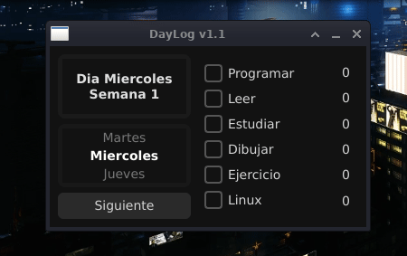

# DayLog v1.1

Aplicación personal para registrar tareas diarias, enfocada en simplicidad, control manual del tiempo y persistencia de datos.

## Descripción

DayLog es una herramienta simple para llevar seguimiento del progreso diario, organizada por días y semanas.

El sistema está diseñado para ser claro, mantenible y fácil de extender a futuro.

## Demo



## Cambios recientes

* Implementación de un contador visual de tareas
* Separación clara entre lógica de conteo (`CounterManager`) y UI (`PanelCounter`)
* Refinamiento del layout para soportar el nuevo panel
* Ajustes menores en estructura para mantener consistencia

## Estructura

```bash
DayLog/
├── main.py # Archivo principal
├── panel/ # UI (incluye contador)
├── manager/ # Lógica de negocio (incluye contador)
├── data/ # Datos generales
├── assets/ # Datos de documentacion
├── build/ # Artefactos de build (PyInstaller)
└── daylog # <<< Ejecutable >>>
```

## Cómo ejecutar

1. Abrir una terminal dentro de la carpeta del proyecto

2. Dar permisos de ejecución al launcher:
   `chmod +x daylog`

3. Ejecutar la aplicación:

* Doble clic en el archivo `daylog`
* o desde terminal:
  `./daylog`
