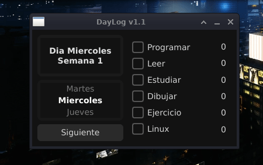

# DayLog

Aplicación personal para registrar tareas diarias, enfocada en simplicidad, control manual del tiempo y persistencia de datos.

## Descripción

DayLog es una herramienta simple para llevar seguimiento del progreso diario, organizada por días y semanas.

## Demo



## Historial de versiones

### [1.1.1] Correxiones al launcher

- Se corrigio la ruta del launcher (`./build/dist/main` -> `./build/dist/daylog`).
- Se agrego una advertencia en el launcher en forma de comentario con la etiqueta `AVISO`.

#### AVISO

- Si se cambia el nombre del ejecutable, es necesario actualizar manualmente la ruta en el launcher (`./build/dist/...`).
- El error ocurre cuando el nombre del archivo en `dist` no coincide con el definido en el script.

### [1.1]

* Implementación de un contador visual de tareas
* Separación clara entre lógica de conteo (`CounterManager`) y UI (`PanelCounter`)
* Refinamiento del layout para soportar el nuevo panel
* Ajustes menores en estructura para mantener consistencia

## Estructura

```bash
DayLog/
├── main.py # Archivo principal
├── panel/ # UI (incluye contador)
├── manager/ # Lógica de negocio (incluye contador)
├── data/ # Datos generales
├── assets/ # Datos de documentacion
├── build/ # Artefactos de build (PyInstaller)
└── daylog # <<< Ejecutable >>>
```

## Cómo ejecutar

1. Abrir una terminal dentro de la carpeta del proyecto

2. Dar permisos de ejecución al launcher:
   `chmod +x daylog`

3. Ejecutar la aplicación:

* Doble clic en el archivo `daylog`
* o desde terminal:
  `./daylog`
